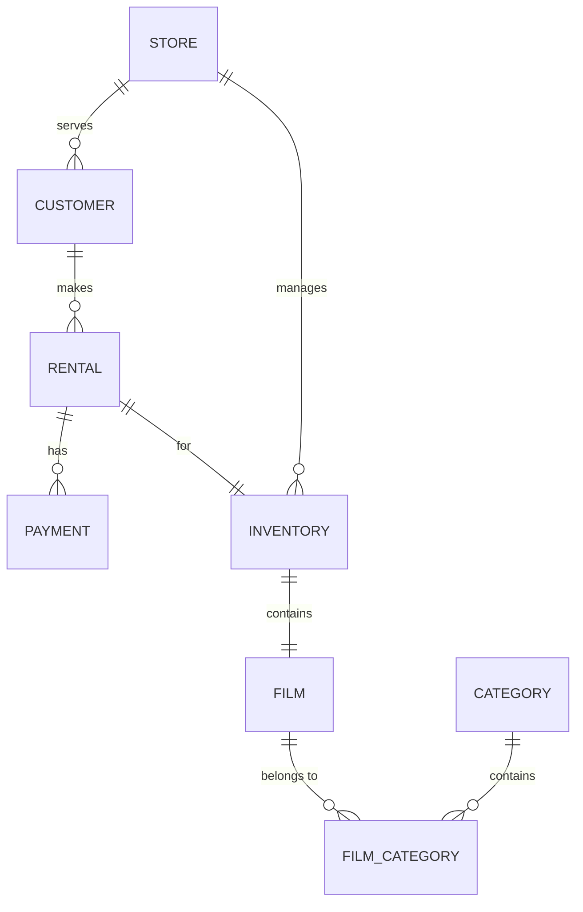

# 📊 Analytical SQL Patterns for Data Engineering

A comprehensive repository showcasing advanced analytical SQL patterns implemented in PostgreSQL using the **Pagila** (DVD Rental) dataset. This project is designed to demonstrate proficiency in complex data transformations, window functions, and business intelligence logic essential for modern Data Engineering.

---

## 🚀 Key Features

- **Sequential Pattern Detection**: Identifying trends over time using `LAG` and `LEAD`.
- **Revenue Analytics**: Monthly growth, cumulative totals, and Pareto analysis.
- **Customer Intelligence**: Calculating Customer Lifetime Value (CLV) and behavior patterns.
- **Advanced Window Functions**: Using `RANK`, `DENSE_RANK`, and `PARTITION BY` for granular insights.
- **Optimization Focused**: Queries designed for efficiency and readability.

---

## 📂 Project Structure

The analytical queries are categorized by their business use case:

### 📈 Revenue & Growth
1.  **[Monthly Revenue](analytical_queries/03_monthly_revenue.sql)**: Period-over-period financial tracking.
2.  **[Revenue Growth](analytical_queries/05_monthly_revenue_growth.sql)**: Calculating month-over-month growth percentages.
3.  **[Pareto Analysis](analytical_queries/10_film_revenue_share_and_pareto.sql)**: Identifying the "Vital Few" (80/20 rule) in film revenue.

### 👤 Customer Analysis
4.  **[Customer Lifetime Value](analytical_queries/06_customer_lifetime_value.sql)**: Quantifying the long-term value of customers.
5.  **[Consecutive Spending](analytical_queries/08_consecutive_spending_increase.sql)**: Detecting customers with increasing rental activity.
6.  **[Top Customers per Store](analytical_queries/07_top_customers_per_store.sql)**: Identifying high-value individuals locally.

### 🎬 Inventory & Rental Performance
7.  **[Rental Durations](analytical_queries/02_avg_rental_duration_by_customer.sql)**: Analyzing customer behavior and turn-around times.
8.  **[Film Revenue Ranking](analytical_queries/09_film_revenue_ranking_by_category.sql)**: Category-wise performance metrics.
9.  **[Rental Windows](analytical_queries/01_rental_start_end_by_customer.sql)**: Tracking the start and end of rental cycles.

---

## 🏗️ Data Model (Pagila)

The project utilizes the core entities of the Pagila schema:



---

## 🛠️ Performance & Schema Analysis

While the core focus is on queries, the project includes placeholders for deeper analysis:
- ⚡ **[Performance Analysis](performance_analysis/)**: Execution plans and optimization strategies.
- 📐 **[Schema Analysis](schema_analysis/)**: Normalization and indexing considerations.

---

## 🏁 How to Run

1.  **Setup PostgreSQL**: Ensure you have a running PostgreSQL instance.
2.  **Load Pagila**: Download and restore the [Pagila database](https://github.com/devrimgunduz/pagila).
3.  **Execute Queries**: Use `psql` or your favorite GUI (DBeaver, pgAdmin) to run any script in `analytical_queries/`.

```bash
psql -d pagila -f analytical_queries/05_monthly_revenue_growth.sql
```

---

## 🛠️ Stack

- **Database**: PostgreSQL 15+
- **Dialect**: PL/pgSQL
- **Concepts**: CTEs, Window Functions, Aggregate Discipline, Sequential Pattern Detection.

---

*Crafted for Data Engineers who love SQL.*